# node.js图文安装
_made by caowujun,2020.11.11_

---
## 1. 下载
    https://nodejs.org/zh-cn/
 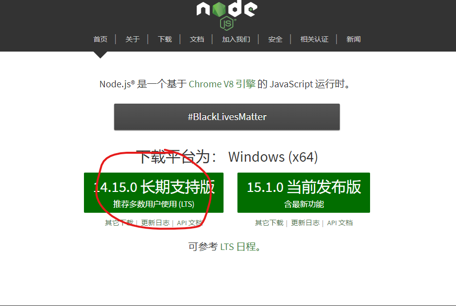


## 2. 按顺序默认安装

 
 
 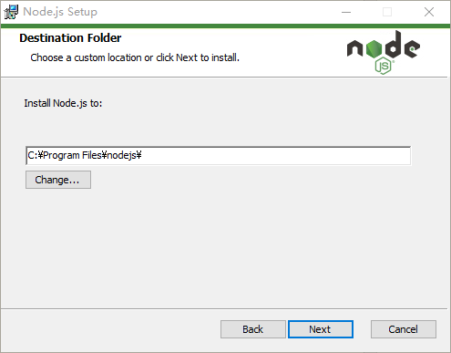
 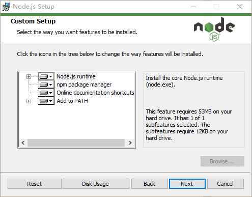
 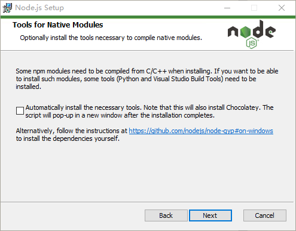
 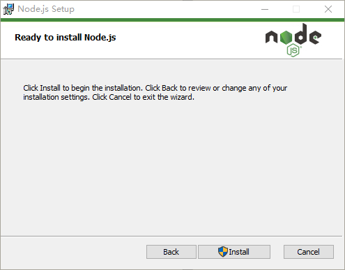
 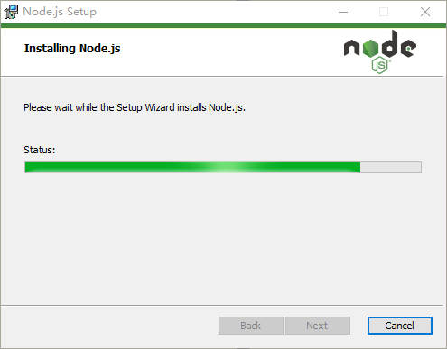
 


## 3. 测试
    打开命令窗口，输入node -v,npm -v ,如图
 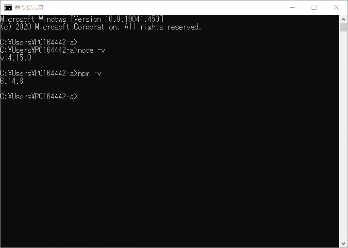


## 4.进阶

node.js安装自带的NPM下载速度慢，并且默认下载目录在C盘，需要我们处理一下。

### 4.1 在硬盘中新建2个文件夹如下

    E:\nodejs\node_cache
    E:\nodejs\node_global

### 4.2 在命令窗口执行以下2个命令

```bash
npm config set prefix "E:\nodejs\node_global"
npm config set cache "E:\nodejs\node_cache"
```

 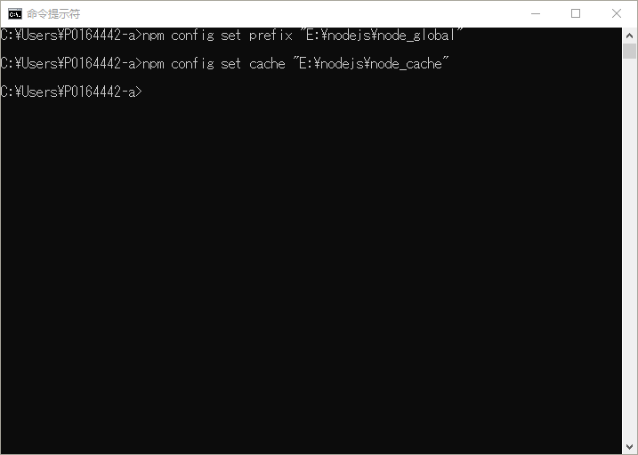
    
### 4.3 打开环境变量配置窗口

 

#### 4.3.1 增加系统变量NODE_PATH，值E:\nodejs\node_global\node_modules

 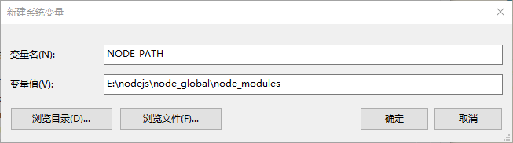
    
#### 4.3.2 修改用户变量PATH，将C:\Users\用户名\AppData\Roaming\npm的值改为E:\nodejs\node_global

修改前

 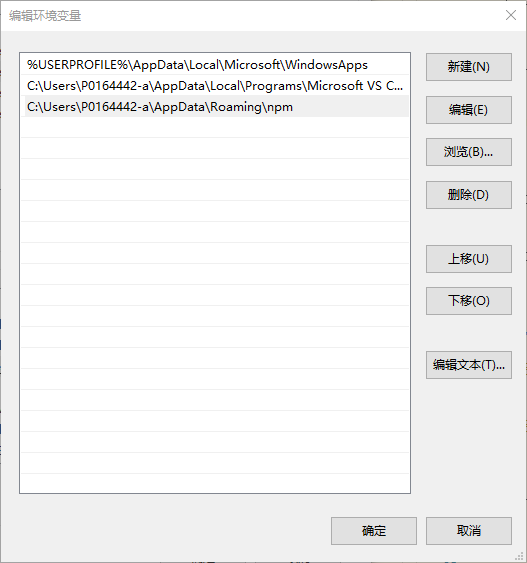

修改后

 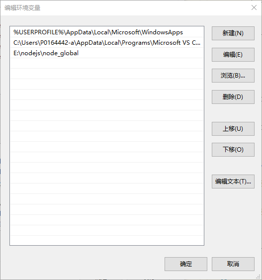

### 4.4 复制一下代码在命令窗口执行，切换到国内淘宝镜像

```bash
npm install -g cnpm --registry=https://registry.npm.taobao.org
```

 
安装后如图所示
 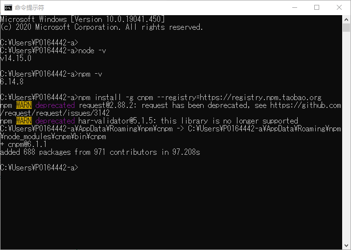

 
 npm升级

 ```bash
 npm install -g npm
 ```