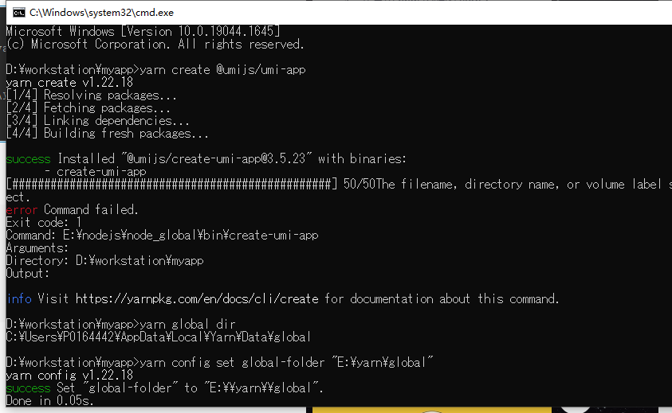

# react&yarn 安装

_made by caowujun,2022.04.19_

[React Router 中文文档](http://react-guide.github.io/react-router-cn/index.html)

---

## 1. 安装

- You are running `create-react-app` 5.0.0, which is behind the latest release

其实就是版本低了，让升级。

```
If you've previously installed create-react-app globally via npm install -g create-react-app, we recommend you uninstall the package using npm uninstall -g create-react-app or yarn global remove create-react-app to ensure that npx always uses the latest version.
```

- 创建 ts 模板的

```bash
npx create-react-app my-app --template typescript
```

```bash
npm install --save react-router-dom
```

webpack

```bash
npm install webpack -g
```

sass

```bash
npm install sass
```

## 2.prettierrc 介绍及文件常见配置

步骤如下：

- vscode 增加插件 Prettier - Code formatter
- 根文件下创建个.prettierrc.js
- 打开 vscode（设置面板），在设置中，搜索 save，勾选 Format On Save

```json
{
  // tab缩进大小,默认为2
  "tabWidth": 4,
  // 使用tab缩进，默认false
  "useTabs": false,
  // 使用分号, 默认true
  "semi": false,
  // 使用单引号, 默认false(在jsx中配置无效, 默认都是双引号)
  "singleQuote": false,
  // 行尾逗号,默认none,可选 none|es5|all
  // es5 包括es5中的数组、对象
  // all 包括函数对象等所有可选
  "TrailingCooma": "all",
  // 对象中的空格 默认true
  // true: { foo: bar }
  // false: {foo: bar}
  "bracketSpacing": true,
  // JSX标签闭合位置 默认false
  // false: <div
  //          className=""
  //          style={{}}
  //       >
  // true: <div
  //          className=""
  //          style={{}} >
  "jsxBracketSameLine": false,
  // 箭头函数参数括号 默认avoid 可选 avoid| always
  // avoid 能省略括号的时候就省略 例如x => x
  // always 总是有括号
  "arrowParens": "avoid"
}
```

既有项目示例

```javascript
module.exports = {
  semi: true,
  trailingComma: 'all',
  singleQuote: true,
  printWidth: 120,
  tabWidth: 4,
  arrowParens: 'always',
};
```

## 3. umi 使用 yarn

安装

```bash
npm install -g yarn
```

查看版本

```bash
yarn --version
```

切换国内源,后面文档里的 yarn 换成 tyarn

```bash
npm i yarn tyarn -g
```

然而在执行创建 umi 的时候报错

```bash
mkdir myapp && cd myapp
yarn create @umijs/umi-app
yarn
```

错误如下


解决方案如下：[参考](https://blog.csdn.net/Jsy_997/article/details/121614243)

- 查看 yarn 路径

```bash
yarn global bin   //E:\nodejs\node_global\bin
```

将获得的路径配置在环境变量-系统变量-path，但是不起作用。

- 查看 yarn 的全局安装位置

```bash
yarn global dir //C:\Users\xx\AppData\Local\Yarn\Data\global.
```

可以发现，yarn 的全局安装位置 和 bin 的位置不一致。

- 修改 yarn 的全局安装位置

```bash
yarn config set global-folder "E:\yarn\global"
yarn config set cache-folder "E:\yarn\cache"
```

- 再查看 yarn 的全局安装位置 和缓存位置

```bash
yarn global dir   //E:\yarn\global
yarn cache dir    //E:\yarn\cache
```

## 4. yarn 基本语法

```bash
yarn  init    //初始化，等同于npm init
yarn    //等同npm install
```

| NPM                           | YARN                       | 说明                                         |
| ----------------------------- | -------------------------- | -------------------------------------------- |
| npm init                      | yarn init                  | 初始化某个项目                               |
| npm install/link              | yarn install/link          | 默认的安装依赖操作                           |
| npm install taco —save        | yarn add taco              | 安装某个依赖，并且默认保存到 package.        |
| npm uninstall taco —save      | yarn remove taco           |   移除某个依赖项目                           |
| npm install taco —save-dev    |   yarn add taco —dev       |     安装某个开发时依赖项目                   |
| npm update taco —save         |    yarn upgrade taco       |         更新某个依赖项目                     |
| npm install taco --global     | yarn global add taco       |     安装某个全局依赖项目                     |
| npm publish/login/logout      |  yarn publish/login/logout |     发布/登录/登出，一系列 NPM Registry 操作 |
| npm run/test                  |  yarn run/test             |     运行某个命令                             |
