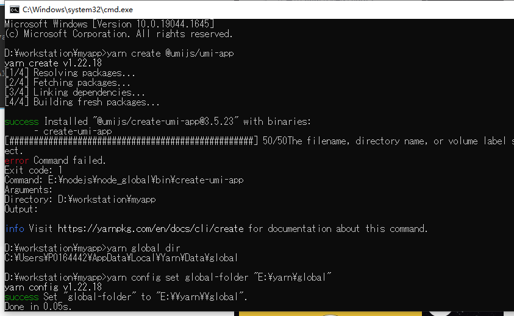

# umi+react+ant design

_made by caowujun,2022.04.19_

[https://umijs.org/zh-CN/docs/getting-started](https://umijs.org/zh-CN/docs/getting-started)
[https://ant.design/docs/spec/introduce-cn](https://ant.design/docs/spec/introduce-cn)
[https://pro.ant.design/zh-CN/](https://pro.ant.design/zh-CN/)
[useRequest](https://zhuanlan.zhihu.com/p/106796295)

---

## 1. umi 使用 yarn

安装

```bash
npm install -g yarn
```

查看版本

```bash
yarn --version
```

切换国内源,后面文档里的 yarn 换成 tyarn

```bash
npm i yarn tyarn -g
```

然而在执行创建 umi 的时候报错

```bash
mkdir myapp && cd myapp
yarn create @umijs/umi-app
yarn
```

错误如下


解决方案如下：[参考](https://blog.csdn.net/Jsy_997/article/details/121614243)

- 查看 yarn 路径

```bash
yarn global bin   //E:\nodejs\node_global\bin
```

将获得的路径配置在环境变量-系统变量-path，但是不起作用。

- 查看 yarn 的全局安装位置

```bash
yarn global dir //C:\Users\xx\AppData\Local\Yarn\Data\global.
```

可以发现，yarn 的全局安装位置 和 bin 的位置不一致。

- 修改 yarn 的全局安装位置

```bash
yarn config set global-folder "E:\yarn\global"
yarn config set cache-folder "E:\yarn\cache"
```

- 再查看 yarn 的全局安装位置 和缓存位置

```bash
yarn global dir   //E:\yarn\global
yarn cache dir    //E:\yarn\cache
```

## 2. yarn 基本语法

```bash
yarn  init    //初始化，等同于npm init
yarn    //等同npm install
```

| NPM                           | YARN                       | 说明                                         |
| ----------------------------- | -------------------------- | -------------------------------------------- |
| npm init                      | yarn init                  | 初始化某个项目                               |
| npm install/link              | yarn install/link          | 默认的安装依赖操作                           |
| npm install taco —save        | yarn add taco              | 安装某个依赖，并且默认保存到 package.        |
| npm uninstall taco —save      | yarn remove taco           |   移除某个依赖项目                           |
| npm install taco —save-dev    |   yarn add taco —dev       |     安装某个开发时依赖项目                   |
| npm update taco —save         |    yarn upgrade taco       |         更新某个依赖项目                     |
| npm install taco --global     | yarn global add taco       |     安装某个全局依赖项目                     |
| npm publish/login/logout      |  yarn publish/login/logout |     发布/登录/登出，一系列 NPM Registry 操作 |
| npm run/test                  |  yarn run/test             |     运行某个命令                             |
