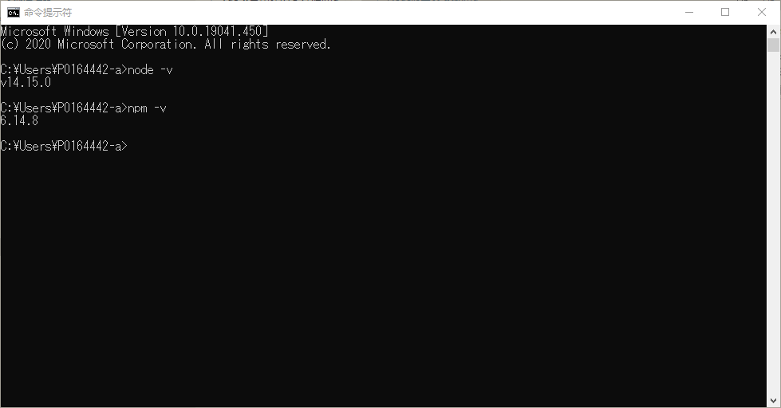
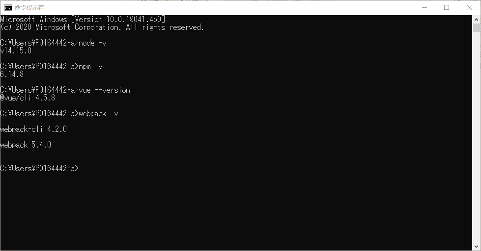
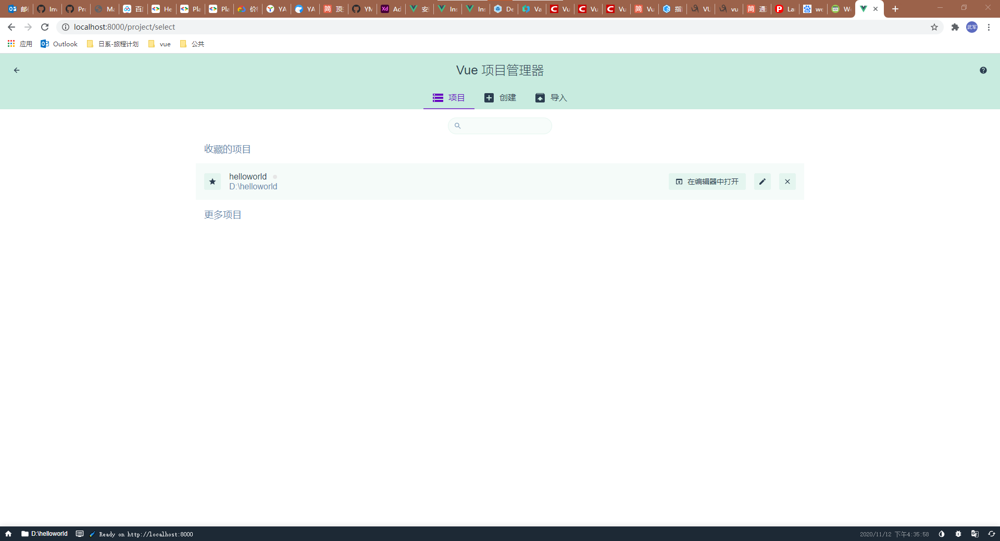
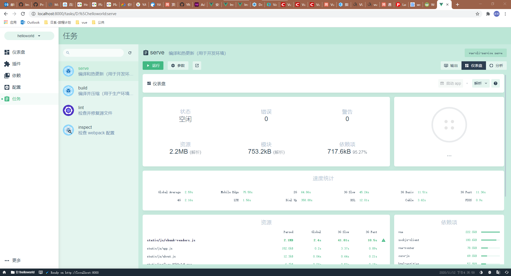
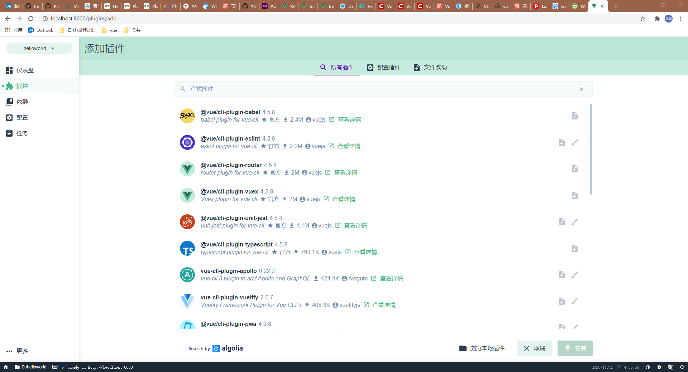

# vue 项目从零开始2.x
_made by caowujun,2020.11.11_

---
创建之前，请先确认安装了node.js,npm，并且npm确保修改为淘宝镜像，命令如下：

```bash
npm install -g cnpm --registry=https://registry.npm.taobao.org
```
备注：有的时候淘宝镜像拉下来的和原始不一样，之前发生过vue3.x，原生的拉下来几百M，淘宝拉下来几个G的情况，注意观察。

我的版本如下：
 

## 1.安装vue
### 1.1 打开cmd命令窗口执行
```bash
cnpm install -g @vue/cli
```
```bash
cnpm install webpack –g
```
```bash
cnpm install webpack-cli –g
```
### 1.2 测试如下 
 

## 2. 创建vue
### 方法1： 打开命令窗口 执行创建项目xxx命令 
```bash
vue create xxx
```
备注：会让你选择预设模板默认的比较简单，建议选用自定义，后面详细介绍 。

### 方法2：UI创建 
```bash
vue ui
```
默认打开网页
 
点击创建来创建新项目

## 3. 术语介绍
```
Babel：ES6 转 ES5

​TypeScript：使用 TypeScript 书写源码

​Progressive Web App （PWA） Support：渐进式Web应用

​Router： 路由

​Vuex： 状态

​CSS Pre-processors：CSS 预处理

​Linter/Formatter：代码风格检查和格式化

​Unit Testing：单元测试。

​E2E Testing：E2E测试
```
## 4. 运行vue

## 方法1：cmd 运行 
测试
```bash
npm run serve
```
打包
```bash
npm run build
```

## 方法2：UI 运行
 


## 5. 深入
新版本的脚手架提供了插件功能,像router，store，如果采用add 插件方式则会在项目自动生成store文件夹及index.js，如果采用npm则不会，所以建议这几个采用add方式。


部分插件比如element ui从原来的~~cnpm i element-ui -S~~更改了为
```bash
vue add element
```
或者从UI
 

如果搜索不到插件可以采用原来的方法增加（像vuex，router，element通过add插件方式添加就不需要执行了）
```bash
cnpm i element-ui -S
cnpm install axios --save
cnpm install vuex --save
cnpm install js-md5 --save
cnpm install vue-router --save
cnpm install echarts --save
npm install qs
```
