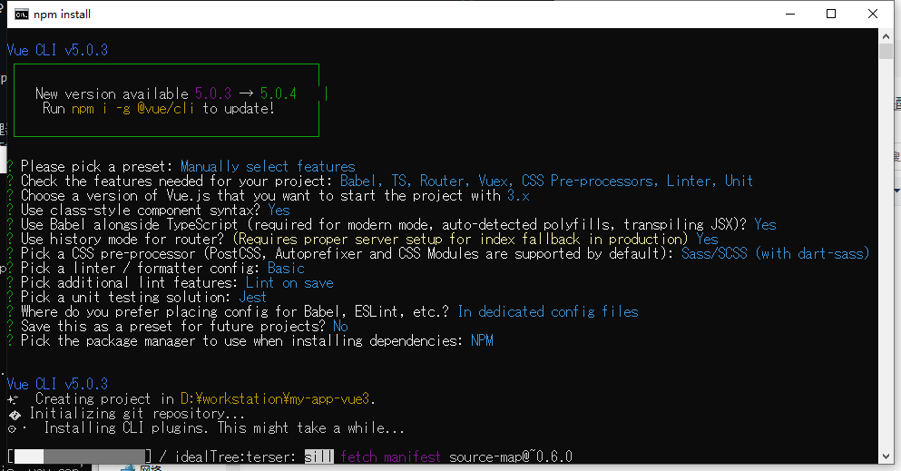

# vue 项目从零开始 3.x

_made by caowujun,2020.11.11_

---

## 1. 安装

命令窗口执行

```bash
npm install vue@next
npm install -D @vue/compiler-sfc  //效果未知
npm install -g @vue/cli
```

检验

```bash
vue --version
```

## 2. 创建

命令窗口执行

```bash
vue create my-app-vue3
```

- Choose Vue version 选择 vue 语法版本，默认选中
- Babel 插件允许我们使用 ES6 模块化语法，默认选中\* TypeScript js 的升级版本，TS 语法中增加了强类型定义
- Progressive Web App (PWA) Support 如果项目是移动端，选择
- Router 路由
- vuex 状态管理
- CSS Pre-processors 样式预处理：如果使用了 SCSS 和 less 语法，勾选此选项
- Linter / Formatter 代码格式语法检测
- Unit Testing 单元测试工具
- E2E Testing 端到端测试工具

```bash
Use class-style component syntax?
```

是否使用 Class 风格装饰器？即原本是：home = new Vue()创建 vue 实例,使用装饰器后：class home extends Vue{},选择 y

```bash
  Use Babel alongside TypeScript (required for modern mode, auto-detected polyfills, transpiling JSX)?
```

使用 Babel 与 TypeScript 一起用于自动检测的填充? 选择 y

```bash
 Use history mode for router? (Requires proper server setup for index fallback in production)
```

路由使用历史模式? 这种模式充分利用 history.pushState API 来完成 URL 跳转而无须重新加载页面，选择 y

```bash
Pick a CSS pre-processor (PostCSS, Autoprefixer and CSS Modules are supported by default)
```

选择哪个 css 预处理器，sass less 差不多，随便选一个
[Sass、LESS 和 Stylus 区别总结](https://blog.csdn.net/pedrojuliet/article/details/72887490)

```bash
Pick a linter / formatter config
```

ESLint with error prevention only // 只进行报错提醒,建议选择
ESLint + Airbnb config // 不严谨模式
ESLint + Standard config // 正常模式
ESLint + Prettier // 严格模式
TSLint (deprecated) // TypeScript 格式验证工具

最终如图：


```bash
🎉  Successfully created project my-app-vue3.
👉  Get started with the following commands.
 $ cd my-app-vue3
 $ npm run serve
```

---

- cnpm 安装 element-plus 会出错，缺少什么 vue@2x,不解，用 npm 吧
- element-plus 必须第一个装，最后装的时候，会把之前的 axios ，i18 统统给删掉，不知道为什么
- cnpm install 会安装大量垃圾文件夹，3G 多

最终执行，结论就是少用 cnpm

```bash
npm install element-plus --save
npm install vue-i18n@next  --save
npm install js-md5 --save
npm install echarts --save
npm install qs --save
npm install axios --save
npm i --save  @types/js-md5
```

## 3. vite，待研究

```bash
npm init vite@latest vuevite --template vue
[文档1](https://blog.csdn.net/weixin_43891485/article/details/117635376)
[文档2](https://www.cnblogs.com/wisewrong/p/13717287.html)
```
